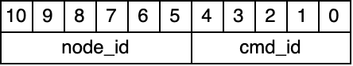

# ODrive Arduino CAN Replacement

This is a project to rewrite the CAN aspect of the ODrive Arduino library as I dislike the implementation.

The ODrive documentation has a .dbc file for the messages sent on the can bus, this is in the /assets folder. A DBC viewer such as <a href=https://www.csselectronics.com/pages/dbc-editor-can-bus-database>this</a> will make the file readable. That dbc file and more implementation details can be found [here](https://docs.odriverobotics.com/v/latest/manual/can-protocol.html).

The current implementation uses function pointers for sending can messages so that this library can be completely can library independent.

### Requirements

- This library uses some of the built-in Arduino function, namely millis() and uses Serial for feedback, this can likely be changed to suit another microcontroller if necessary.
- The upper level code will need to handle reading can to send into the motor object(s) and for creating a function that can be passed into the object to allow messages to be sent.

## Implementation

### Sending CAN messages & Constructor

To implement this library you must create a function that uses the following prototype:

```C++
int send_can (uint16_t can_id, uint8_t len, uint8_t* data, bool rtr);
```
although _send_can_ can be changed to a name of your choice.

can_id is the id of the message that will be sent.\
len is the length of the data array in bytes.\
data is a pointer to an array of bytes that contains the message, it is the same length an len.\
rtr is for if the RTR bit should be set to 0 (false) or 1 (true), see the [RTR](#remote-transmission-request-rtr) section for more details.

The function should return one of four results;
- success (0) - Message was successfully sent
- can_bus_fault (1) - There was an issue sending the message
- can_bus_no_response (2) - No nodes acknowledged the message, this can either indicate that the message was not actually put onto the bus or that it was successfuly put onto the bus but there are no nodes that responded
- can_transmission_fail (3) - A more general transmission failure for libraries that do not distinguish between a bus fault and no response, use can_bus_fault and can_bus_no_response primarily.

A pointer this function and the node ID of the motor must be passed into the constuctor of the object, for example with a motor with an ID of 0,
```C++
ODriveCanMtr mtr1(&send_can, 0);
```
Details about node ID can be found [here](#node-id).

### Receiving CAN messages

The library **does not** read the CAN bus, so your implementation must read the CAN messages regularly and pass information to the object(s) using the process_msg or process_cmd methods.

process_msg takes the CAN ID directly with no additional effort, if the message is for a different node ID, it will return not_this_node (-1), if the message is for that node, process_cmd will be internally called.

process_cmd requires the node ID to be removed from the CAN ID first, this method relies on you checking which node the message belongs to beforehand, the node ID can be obtained using the node_id method.

### Setting up the motor

Before the motor can be run, it must be configured with the desired control mode, input mode and axis state.

A detailed list of the input modes can be found [here](https://docs.odriverobotics.com/v/latest/fibre_types/com_odriverobotics_ODrive.html#ODrive.Controller.InputMode), the control modes can be found [here](https://docs.odriverobotics.com/v/latest/fibre_types/com_odriverobotics_ODrive.html#ODrive.Controller.ControlMode) and the axis states can be found [here](https://docs.odriverobotics.com/v/latest/fibre_types/com_odriverobotics_ODrive.html#ODrive.Axis.AxisState).

Once you know what you want to set the motor to, call the set_cont_mode method passing in the control mode and input mode, and then use the set_axis_state method with the desired axis state.

If you're unsure, use one of the two following presets.

#### Position Control
```C++
mtr1.set_cont_mode(position_control, vel_ramp);
mtr1.set_axis_state(closed_loop_control);
```

use the set_ip_pos method to change position for this control method
#### Velocity Control
```C++
mtr1.set_cont_mode(velocity_control, vel_ramp);
mtr1.set_axis_state(closed_loop_control);
```

Use the set_ip_vel method to change velocity (please note this is revolutions/second as measured at the encoder)

## Background Knowledge

### Controller Area Network (CAN) bus

CAN is a communication standard often used for automotive applications that use a twister pair to send a message. For purposes of this library, only CAN 2.0 needs to be understood, CAN Flexible Data-rate (FD) and CAN XL cannot be used to communicate with ODrive devices.\
Each CAN message has an ID; For standard CAN (2.0a) this is 11 bits (0-2047) and for extended CAN (2.0b) this is 29 bits (0-536,870,911). However, the ODrive standard is built around standard CAN, so extended CAN cannot be used to communicate with the motor, it is probably ok to have extended CAN messages on the same bus, but I haven't tested that.\
There is no "controller" of a CAN network, instead messages are prioritised by their identifier where the lower identifier wins (i.e. ID 0 takes priority over ID 5). In CAN 2.0, all devices must agree on a bit rate with the following being the most common options,
- 125 kbps
- 250 kbps
- 500 kpbs
- 1000 kbps
  
500 kbps is the most common choice as 1000 kbps can become unreliable at distances over 40m.

#### CAN 2.0 Physical Layer (OSI Layer 1)

In CAN, one of the conductors is labelled CAN High (often abreviated to CAN H, CH or just H) with the other CAN Low (CAN L, CL or just L). CAN High and Low act as a differential pair, so changes in the voltage caused by data transmission will cause the two conductors to change in opposite directions (i.e. CAN high changing from 0 V to bus voltage and CAN Low doing the opposite). Changes in voltage where both conductors change in the same direction (i.e. CAN high changing from 0 V to 0.1 V and CAN Low changing from 5 V to 5.1V) are interpreted as noise and are ignored. To ensure that noise will affect both conductors equally, the conductors **must** be a twisted pair, with standard being >1 twist per inch (1 twist per 25.4 mm) with more twists being better but increasing the length of cable needed.

##### Bit signalling

The CAN bus has two steady states, dominant and recessive, dominant represents a 0 and recessive represents a 1. 
The CAN bus is transmitting a dominant state if CL is pulled to ground and CH is pulled to the bus voltage, it is referred to as dominant because another node cannot transmit a recessive bit while a dominant bit is being sent, this is how the ID priority works. If a node tries to send a recessive bit while another node sends a dominant bit, it will stop trying to transmit as a node sending a lower ID message (as more zeros, the lower the ID), takes priority.
Recessive is represented by CL at bus voltage and CH pulled to ground, this is the normal state of the bus between messages.

#### Frame structure of standard CAN (OSI Layer 2)

The frame is broken into five parts,
- Arbitration
- Control
- Data
- Cyclic Redundancy Check (CRC)
- End of Frame (EoF)

Data, CRC and most of EoF are not important for understanding this library and will not be explained.

##### Arbitration

This section is where the CAN ID, the Identifier Extension bit (IDE) and the Remote Transmission Request (RTR) reside.
IDE determines if the message follows standard or extended CAN, for our use here, it should be dominant (0).
RTR has a special use for this application, so it needs more explanation.

###### Remote Transmission Request (RTR)

This bit is used to request a message from another node. For normal messages this bit will be dominant (0). If a node wants to request a message from ID 0x50, it will set the CAN ID to 0x50 and set the RTR bit to recessive (1), the data field for this message is left empty. If the node that sends that message is on the bus, it will respond with the same CAN ID with the RTR bit set to dominant. 
The RTR bit is placed just after the end of the CAN ID so if an RTR message and a normal message of the same CAN ID are attempted to be sent at the same time; the data message will take priority (which is ideal as it is the message we want).

##### Control

The only part of control that is important to know about is the Data Length Code (DLC), this is a four-bit number (0-15) which represents how many bytes of data are contained in the message. As the data field is 8 bytes is size, the DLC can be 0-8 (0000-1000 in binary).

##### EoF

The part of EoF that is important to know about is the Acknowledge bit (ACK). The transmitting node will assert this bit as recessive (1), every other node on the bus will assert the ACK bit as dominant (0) if and only if they detect no errors in the transmitted message, the transmitting node can check the bus to see if the bit has been made dominant to determine if another node has correctly received the message. If the bus is still recessive it either means that there are no nodes that received the message or the message was sent incorrectly.

### ODrive CAN Standard

#### How CAN ID is used

The CAN ID in ODrive's standard is broken into two pieces, the Node ID and the Command ID. The Node ID determines which motor the message is for/from and the Command ID determines which command the message is. Of the 11 bits of the CAN ID, the upper six bits are the Node ID and the lower five are the Command ID.



##### Node ID

The Node ID ranges from 0-63 (0x0-0x3F) with 63 being a broadcast ID that all motors will respond to. To get the Node ID from the CAN ID, the easiest way is to bit shift the CAN ID five to the right.

```C++
node_id = (can_id >> 5);
```

##### Command ID

The command ID ranges from 0-31 (0x0-0x1F). TO get the Command ID from the CAN ID, the easiest way is to bitwise and the CAN ID with 31 (0x1F).

```C++
command_id = (can_id & 0x1F);
```

ODrive have defined the commands as;

|Command| Number (Hexadecimal)|
| :--: | :-- |
|Get Version | 0x00 |
|Heartbeat | 0x01 |
|Estop | 0x02 |
|Get Error | 0x03 |
|Rx sdo | 0x04 |
|Tx sdo | 0x05 |
|Address | 0x06 |
|Set Axis State | 0x07 |
|**NO COMMAND** | 0x08 |
|Get Encoder Estimates | 0x09 |
|**NO COMMAND** | 0x0A |
|Set Controller Mode | 0x0B |
|Set Input Pos | 0x0C |
|Set Input Vel | 0x0D |
|Set Input Torque | 0x0E |
|Set Limits | 0x0F |
|**NO COMMAND** | 0x10 |
|Set Traj Vel Limit | 0x11 |
|Set Traj Accel Limits | 0x12 |
|Set Traj Interia | 0x13 |
|Get Iq | 0x14 |
|Get Temperature | 0x15 |
|Reboot | 0x16 |
|Get Bus Voltage Current | 0x17 | 
|Clear Errors | 0x18 |
|Set Absolute Position | 0x19 |
|Set Pos Gain | 0x1A |
|Set Vel Gain | 0x1B |
|Get Torques | 0x1C |
|Get Powers | 0x1D |
|**NO COMMAND** | 0x1E |
|Enter DFU Mode | 0x1F |


